# Data Exfiltration Simulation — Volume-Based Detection Analysis

## Objective
Simulate real data exfiltration — a compromised account bulk-downloading sensitive files in rapid succession — against a baseline of ordinary user activity, and build detection logic based on transfer volume and speed rather than login success/failure. This is the first project in the series where the attack signal is a quantity (bytes transferred), not a pass/fail outcome.

## Environment
- SIEM: Splunk Enterprise (local lab)
- Target: Flask file server (`vulnerable_fileserver_target.py`) — real endpoint serving files of varying size, logs real bytes transferred per download
- Baseline: `normal_user_sim.py` — legitimate user (`mudasir`) downloading 3 small files with 3-second gaps
- Attacker: `exfil_attacker.py` — compromised service account (`svc_account`) downloading 3 large sensitive files with 0.5-second gaps
- Log Source: `exfil_logs.log`
- Sourcetype: `exfil_detection_analysis`
- Index: `main`

## Queries Used

**Raw event inspection — single event field breakdown:**
```spl
source="exfil_logs.log" host="KALI" sourcetype="exfil_detection_analysis"
| head 1
```
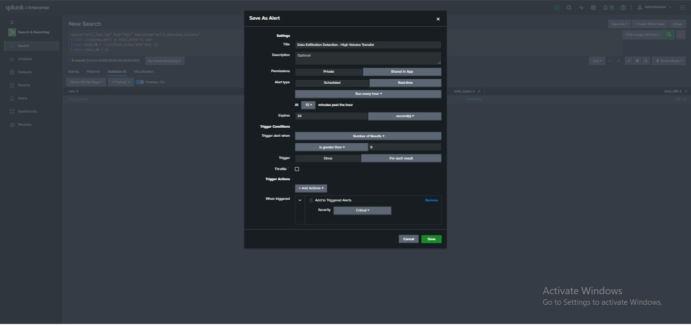

**All 6 events raw — confirming both normal and exfil activity logged:**
```spl
source="exfil_logs.log" host="KALI" sourcetype="exfil_detection_analysis"
```
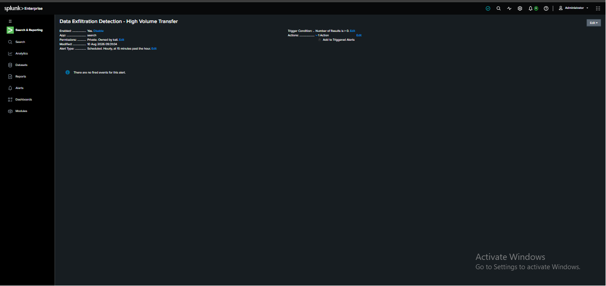

**Full stats breakdown — every field together:**
```spl
source="exfil_logs.log" host="KALI" sourcetype="exfil_detection_analysis"
| stats count by EventType, user, src_ip, _time, dest_host, host, splunk_server, bytes_sent, sourcetype, filename
```
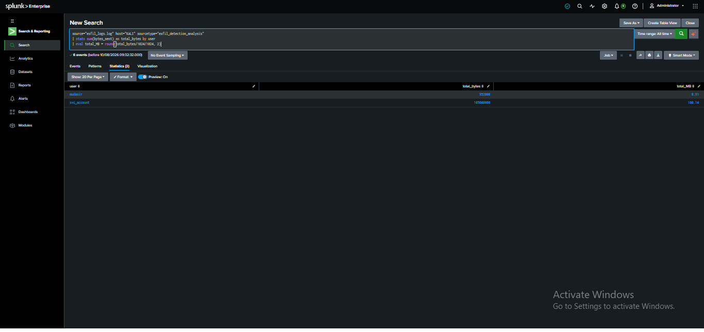

**Total bytes and file count per user:**
```spl
source="exfil_logs.log" host="KALI" sourcetype="exfil_detection_analysis"
| stats sum(bytes_sent) as total_bytes, count as file_count by user
| sort -total_bytes
```
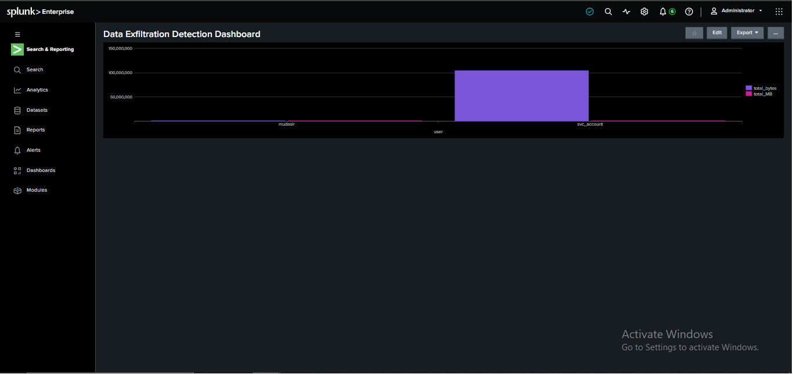

**Human-readable size with risk flagging:**
```spl
source="exfil_logs.log" host="KALI" sourcetype="exfil_detection_analysis"
| stats sum(bytes_sent) as total_bytes, count as file_count by user
| eval total_MB = round(total_bytes/1024/1024, 2)
| eval risk = if(total_MB > 10, "HIGH - possible exfiltration", "normal")
| table user, file_count, total_MB, risk
```
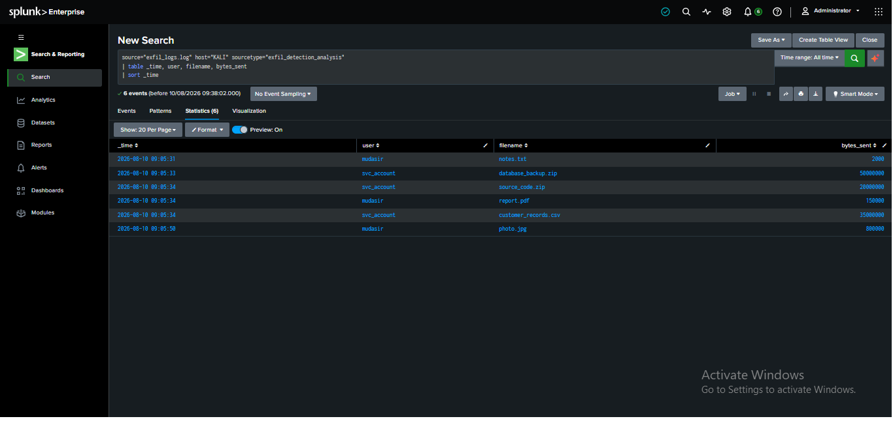

**Transfer rate — MB per second, the speed signature:**
```spl
source="exfil_logs.log" host="KALI" sourcetype="exfil_detection_analysis"
| stats count as downloads, sum(bytes_sent) as total_bytes, min(_time) as first_dl, max(_time) as last_dl by user
| eval duration_sec = last_dl - first_dl
| eval MB_per_sec = round((total_bytes/1024/1024) / (duration_sec+1), 2)
| table user, downloads, duration_sec, MB_per_sec
```
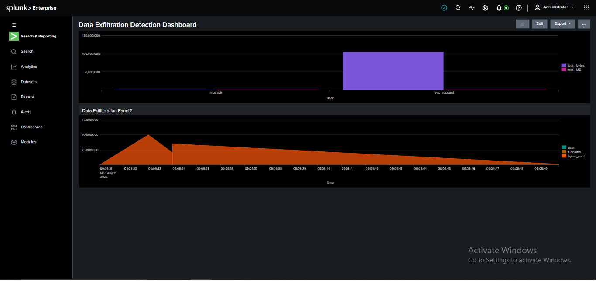

**Per-file breakdown — which specific files drove the volume:**
```spl
source="exfil_logs.log" host="KALI" sourcetype="exfil_detection_analysis"
| stats sum(bytes_sent) as bytes, count as times_downloaded by filename, user
| sort -bytes
```
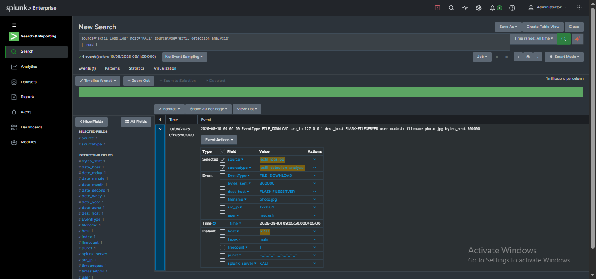

**High-volume threshold query (basis for the alert):**
```spl
source="exfil_logs.log" host="KALI" sourcetype="exfil_detection_analysis"
| stats sum(bytes_sent) as total_bytes by user
| eval total_MB = round(total_bytes/1024/1024, 2)
| where total_MB > 10
```
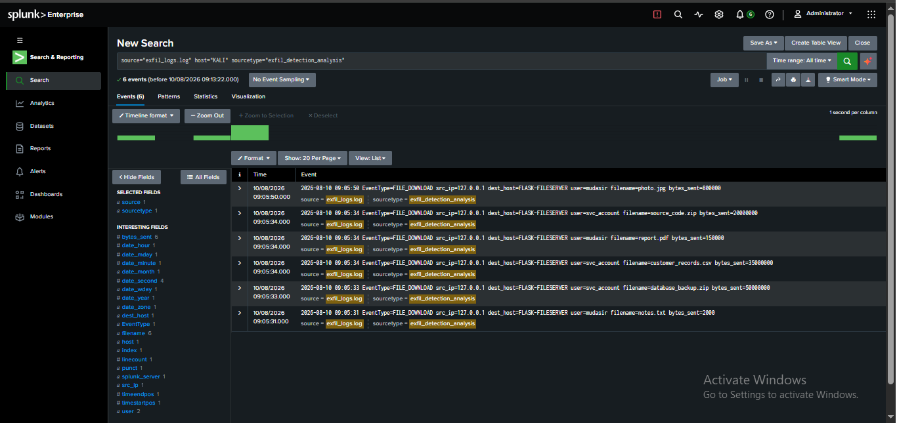

## Results
| user | file_count | total_MB | risk |
|---|---|---|---|
| mudasir | 3 | 0.91 | normal |
| svc_account | 3 | 100.14 | HIGH - possible exfiltration |

| user | downloads | duration_sec | MB_per_sec |
|---|---|---|---|
| mudasir | 3 | 19 | 0.05 |
| svc_account | 3 | 1 | 50.07 |

`svc_account` moved over 100 MB in roughly 1 second — a transfer rate over 1000x faster than the legitimate user, despite both accounts making exactly 3 requests each. Request count alone would never have caught this; volume and speed did.

## Findings
- **Request count is a useless signal here** — both accounts made exactly 3 downloads. Any detection rule based on "number of requests" would treat them identically. Only `bytes_sent` and timing separated the two.
- **`total_MB > 10` cleanly isolates the incident** with zero false positives against the legitimate baseline (0.91 MB vs 100.14 MB) — a wide enough margin that this threshold doesn't need fine-tuning to work in this dataset.
- **Transfer rate (`MB_per_sec`) is an even stronger signal than raw volume** — a slow, legitimate 100MB backup job spread across an hour would still be "high volume" but not "high rate." Combining both gives higher-confidence detection than either alone.
- **The specific files targeted matter for triage** — `database_backup.zip`, `customer_records.csv`, and `source_code.zip` are all clearly sensitive by name; a real SOC analyst would prioritize this over, say, a large but non-sensitive video file transfer.
- **`svc_account` (a service account, not a real employee) making bulk sensitive-data downloads is itself a red flag independent of volume** — service accounts should have narrow, predictable, automatable access patterns; sudden bulk activity from one is a classic sign of a hijacked credential or token.

## Detection Opportunity
```spl
source="exfil_logs.log" host="KALI" sourcetype="exfil_detection_analysis"
| stats sum(bytes_sent) as total_bytes by user
| eval total_MB = round(total_bytes/1024/1024, 2)
| where total_MB > 10
```
Rule logic: **any single user or account transferring more than 10 MB total within the search window** = possible data exfiltration, escalate for review.

**MITRE ATT&CK**: T1041 — Exfiltration Over C2 Channel | Tactic: Exfiltration
**Secondary mapping** (initial access via service account): T1078 — Valid Accounts | Tactic: Defense Evasion, Persistence, Privilege Escalation, Initial Access

## Live Detection Alert
Converted the detection query above into a working Splunk alert.

**Alert**: Data Exfiltration Detection - High Volume Transfer
**Trigger condition**: Number of Results > 0
**Alert type**: Scheduled, hourly at 15 minutes past the hour
**Action**: Add to Triggered Alerts, Severity Critical
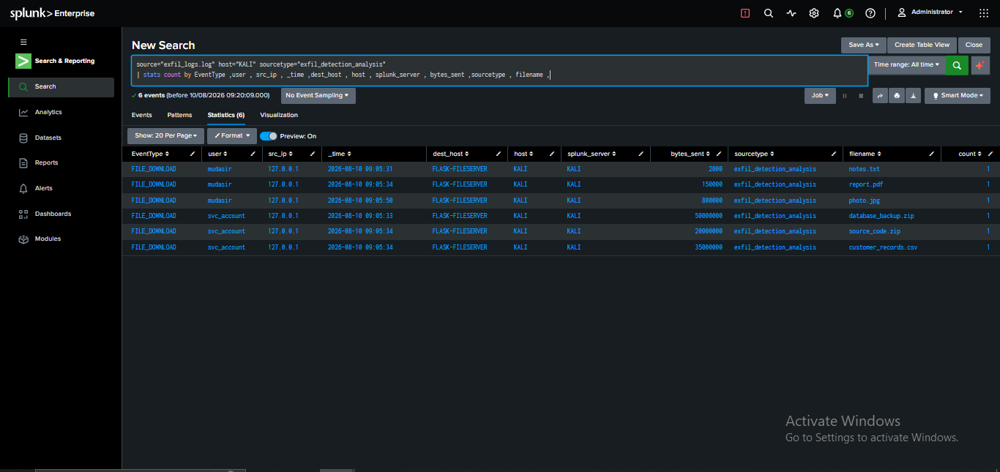
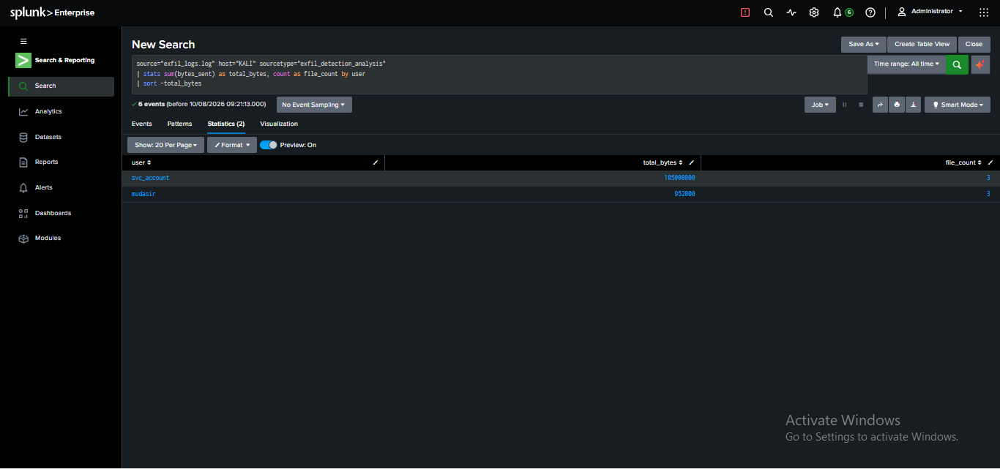

## Dashboard
Built "Data Exfiltration Detection Dashboard" as a Classic Dashboard with three panels: total bytes/MB transferred per user (bar chart, shows the stark svc_account spike), a time-series panel showing bytes_sent activity across the attack window, and a combined downloads/rate panel showing the full campaign summary (downloads, total_bytes, duration_sec, MB_per_sec) side by side for both users.
```spl
source="exfil_logs.log" host="KALI" sourcetype="exfil_detection_analysis"
| stats count as downloads, sum(bytes_sent) as total_bytes, min(_time) as first_dl, max(_time) as last_dl by user
| eval duration_sec = last_dl - first_dl
| eval MB_per_sec = round((total_bytes/1024/1024) / (duration_sec+1), 2)
```
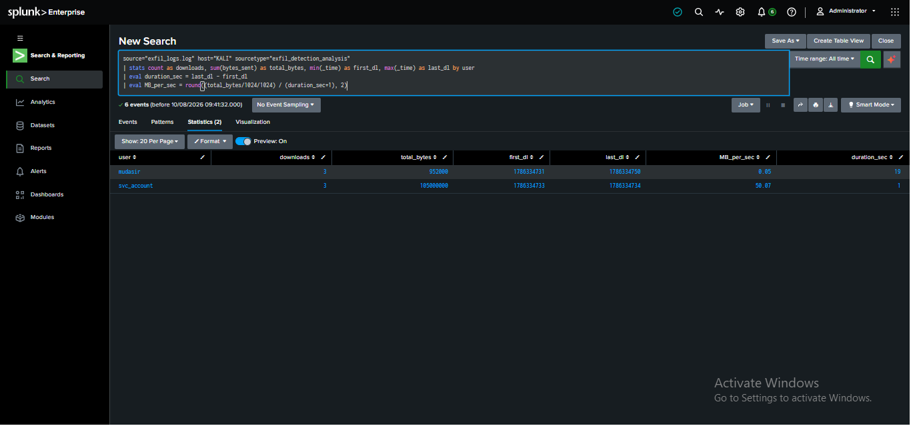
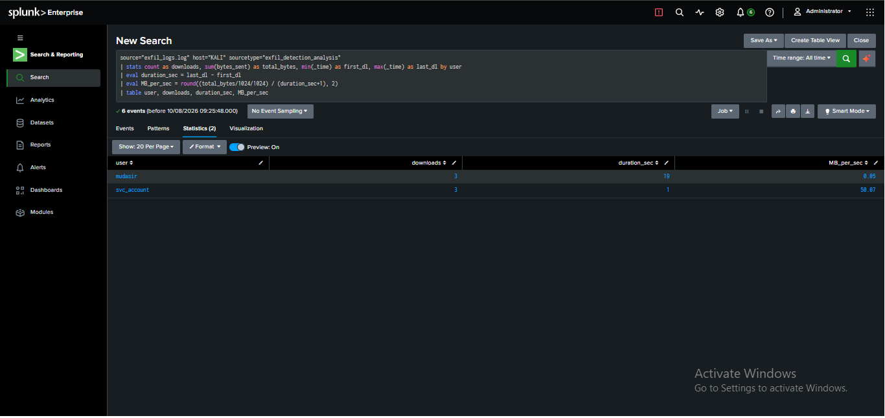
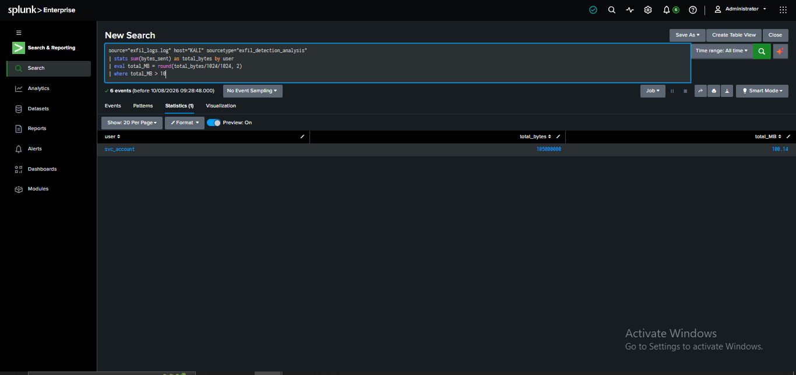
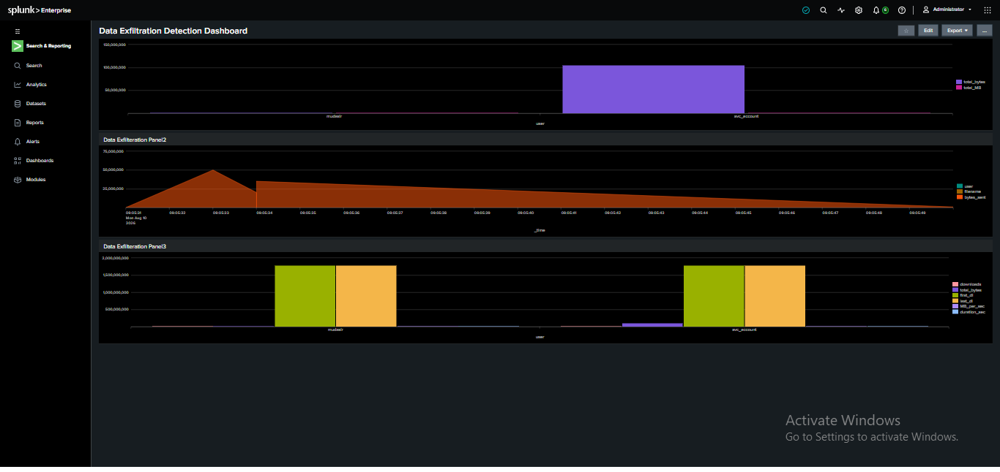

## What I Learned
- This project required a completely different detection mental model than the previous three — `stats sum()` instead of `stats count()`, because the signal here is a *quantity* (bytes) rather than an *event occurrence* (login success/fail).
- A single metric (total volume) can be strong on its own, but pairing it with a second metric (transfer rate) makes the detection far more resistant to evasion — an attacker who slows down to stay under a volume threshold would still spike on rate, and vice versa.
- Exfiltration detection is inherently baseline-dependent — "10 MB" is only meaningful because the legitimate user's baseline (under 1 MB) makes it an obvious outlier; in a real environment this threshold would need to be tuned against actual normal traffic, not assumed.
- Service/system accounts deserve their own detection profile separate from human users — their "normal" behavior is narrower and more predictable, so anomalies are easier to flag with tighter thresholds.

## Next Steps
- Add a dedicated detection rule specifically for service-account activity, with a much lower volume threshold than human-user accounts
- Test a slow, low-and-slow exfiltration pattern (small transfers spread over hours) to see if the current threshold-based rule misses it the way the brute-force rule missed the password spray
- Correlate this exfiltration event with the account's authentication history — was `svc_account` recently involved in any suspicious login activity from prior projects, and did credential compromise precede this data theft
- Extend the alert to fire on `MB_per_sec` exceeding a threshold as a second, independent trigger condition
